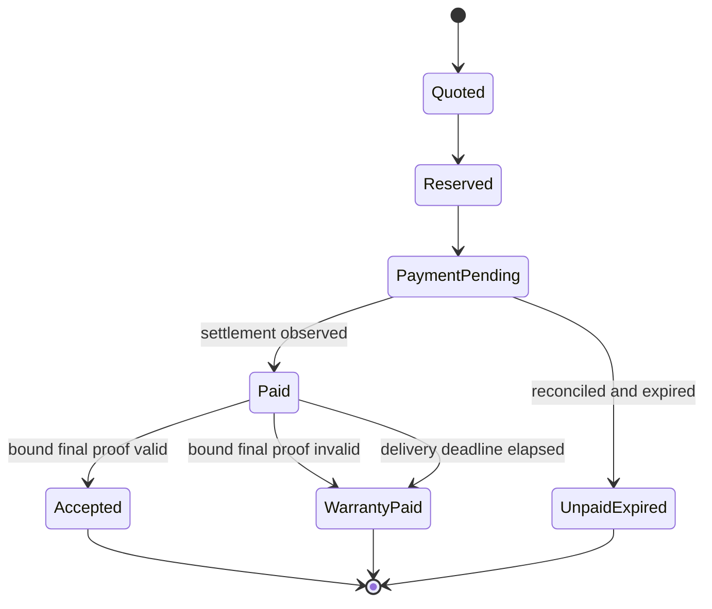

# BlockTerms product brief

## One-line pitch

Buy live blockchain data through x402, verify its promised state, and recover value from provider collateral when the final delivery breaks its terms.

## Problem

A payment receipt proves that an agent paid. It does not prove that the returned data belongs to the promised chain, block, contract layout, or fields. When automated systems act on paid data, an HTTP success response is too weak a service guarantee.

## Product

BlockTerms turns a narrow data request into signed machine-readable terms. A provider reserves collateral before the buyer pays. The buyer agent completes a real Hedera x402 request through Blocky402. The provider returns live standardized Graph data plus a bounded storage witness. Deterministic verification accepts the delivery or applies the agreed warranty state.

## Defensible claim

BlockTerms binds a paid multi-protocol snapshot to a specific block and selected storage fields, then settles an invalid final commitment from pre-reserved collateral without an LLM judge.

## Agent authority

The agent can select among allowlisted providers, buy supported queries within a total budget, verify deliveries, retry once within policy, and request human approval. It cannot change the source chain, supported verifier, payment asset, payee allowlist, proof scope, or spending ceiling.

## Product states

## Initial customer test

Interview agent SDK and risk-infrastructure teams about whether they will pay for a machine-enforceable, narrowly scoped data warranty rather than a higher-level provider reputation score. Measure which fields and maximum acceptable latency justify the additional cost.

## Non-goals

BlockTerms is not an investment agent, exchange, unrestricted API bazaar, oracle network, fraud court, subjective reputation registry, or proof of all indexed data. Its curated marketplace only activates products with an executable supported proof profile. It does not promise that a financially correct state value leads to a good decision.
