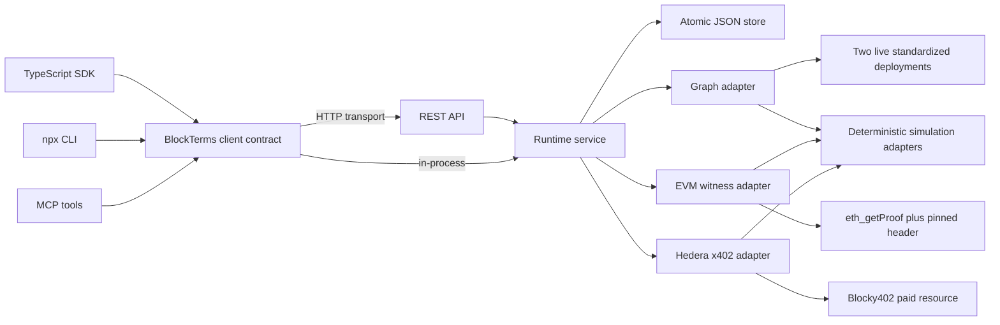

# Agent-Native Runtime Design

**Date:** 2026-09-12
**Status:** Approved by the owner's instruction to choose the architecture and continue autonomously

## Goal

Turn BlockTerms from a frontend and protocol-state foundation into a production-ready local runtime that agents can use without the frontend. The same request lifecycle must be available through a TypeScript SDK, an HTTP API, an `npx` CLI, and an MCP server. The complete lifecycle must run with deterministic simulation adapters before credentials exist and switch to real Graph, EVM RPC, and Hedera x402 adapters when complete live configuration is supplied.

## Constraints

- Preserve the existing order-state invariants and the distinction between an original payment and a warranty transfer.
- Never label simulation output as live evidence.
- Never silently replace a failed live operation with mock output.
- `auto` mode may select simulation only before execution, when live configuration is incomplete, and must record the missing configuration names.
- Deterministic code enforces query shape, spending ceiling, allowed networks, proof bounds, deadlines, and state transitions.
- Secrets are read from process environment or injected configuration and never written to the order store, logs, exports, or HTTP responses.
- One request pattern spans two standardized Graph deployments.
- EIP-1186 validation remains limited to the requested account and one to three selected storage slots at a pinned block.

## Considered approaches

### 1. Independent implementations per interface

Each of the SDK, CLI, API, and MCP server could own its own orchestration. This would ship quickly at first but duplicate validation and make evidence behavior diverge. Rejected.

### 2. Frontend API routes as the product backend

Next.js route handlers could expose the runtime. This fits Vercel but couples agents to frontend deployment and offers weak local durability for long-running operations. Rejected for the agent-native runtime.

### 3. Shared service kernel with ports and adapters

A framework-neutral core owns validation, persistence, status, and orchestration. Interfaces translate their transport into the same methods. Real and simulation integrations implement the same ports. Selected because it keeps every agent surface behaviorally identical and makes credential-gated integrations independently testable.

## Architecture



## Workspace boundaries

- `packages/contracts`: Zod schemas and serializable public types for requests, orders, results, errors, health, and capabilities.
- `packages/core`: runtime service, orchestration, configuration selection, and repository ports.
- `packages/integrations`: deterministic simulation adapters and real Graph, JSON-RPC witness, and Hedera x402 adapters.
- `packages/sdk`: publishable TypeScript client with in-process and HTTP transports.
- `services/api`: loopback-by-default Node HTTP server implementing `/v1` JSON endpoints.
- `apps/cli`: publishable `blockterms` binary used with `npx blockterms`.
- `apps/mcp`: publishable `blockterms-mcp` stdio server built with the official MCP TypeScript server package.

## Public data model

`SubmitRequest` contains:

- `mode`: `auto`, `simulation`, or `live`;
- `query`: standardized pool query name, pinned block number, and maximum of three pools;
- `witness`: EVM network, 20-byte account address, one to three canonical storage slots, and the same pinned block as a canonical hex quantity;
- `policy`: maximum payment in atomic units, payment network allowlist, deadline in milliseconds, and expected x402 resource URL;
- optional `metadata`: caller-owned JSON limited to 8 KiB.

An `OrderRecord` contains a stable UUID, timestamps, current phase, selected evidence mode, fallback reasons, protocol state, sanitized events, and either a result or structured error. It never contains environment configuration or authorization headers.

Phases are `queued`, `running`, `completed`, `configuration_required`, and `failed`. A result reports normalized Graph snapshots, bounded witness measurements, payment receipt metadata, delivery decision, and the terminal protocol state.

## Runtime flow

1. `submit` validates and persists a queued order.
2. `run` atomically marks the order running and resolves execution mode.
3. In `live` mode, incomplete configuration produces `configuration_required` without making a network call.
4. In `auto` mode, incomplete configuration selects simulation before execution and records each missing variable.
5. The Graph adapter queries two distinct deployments at the same block and validates the shared schema version.
6. The witness adapter calls `eth_getProof` and `eth_getBlockByNumber`, validates account, slot count, block, and proof encoding, and records measurements.
7. The payment adapter probes the resource. A 402 response is handled with the official x402 Hedera scheme, a policy selector rejects disallowed network or over-budget requirements, and the retried response must include a decodable payment response header.
8. Deterministic verification compares requested and delivered scope. A valid delivery becomes `accepted`; an invalid delivery becomes `warranty-paid` while retaining the original payment receipt identifier.
9. The sanitized result is persisted and returned through every interface.

The simulation adapter follows the same phases with deterministic synthetic identifiers prefixed `sim_`. It does not emit transaction hashes, explorer links, or live-evidence claims.

## SDK

The SDK exports `BlockTermsClient` with these methods:

```ts
submit(input: SubmitRequest): Promise<OrderRecord>
run(orderId: string): Promise<OrderRecord>
getOrder(orderId: string): Promise<OrderRecord>
getStatus(orderId: string): Promise<OrderStatus>
getResult(orderId: string): Promise<ExecutionResult>
listOrders(options?: { limit?: number }): Promise<OrderRecord[]>
health(): Promise<HealthResponse>
capabilities(): Promise<CapabilitiesResponse>
```

`createLocalClient` builds an in-process runtime backed by an atomic JSON file. `createHttpClient` targets a remote service and implements the same methods.

## HTTP API

- `GET /health`
- `GET /v1/capabilities`
- `POST /v1/orders`
- `GET /v1/orders?limit=50`
- `GET /v1/orders/:id`
- `GET /v1/orders/:id/status`
- `GET /v1/orders/:id/result`
- `POST /v1/orders/:id/run`

The server accepts JSON only, limits request bodies, uses loopback binding by default, returns request IDs, maps domain errors to stable JSON codes, and handles graceful shutdown. Optional `BLOCKTERMS_API_TOKEN` enables bearer authentication for non-loopback use.

## CLI

Commands mirror the client contract:

```text
blockterms submit --file request.json [--run]
blockterms run <order-id>
blockterms get <order-id>
blockterms status <order-id>
blockterms result <order-id>
blockterms list [--limit 50]
blockterms capabilities
blockterms health
blockterms serve [--host 127.0.0.1] [--port 8787]
blockterms example [--mode simulation]
```

All successful command output is JSON on stdout. Diagnostics use stderr. Exit codes distinguish validation, missing configuration, not found, and runtime failure.

## MCP

The stdio server registers tools `submit_request`, `run_order`, `get_order`, `get_status`, `get_result`, `list_orders`, and `get_capabilities`. Tool results include structured JSON and a concise text block. Reads are annotated read-only; submission and execution are annotated as non-destructive writes. stdout is reserved for MCP protocol traffic.

## Failure handling

Domain errors have stable codes: `VALIDATION_ERROR`, `NOT_FOUND`, `CONFLICT`, `CONFIGURATION_REQUIRED`, `POLICY_REJECTED`, `UPSTREAM_ERROR`, and `INTERNAL_ERROR`. Stored errors expose safe messages and missing variable names but never secret values or upstream authorization headers. A failed execution remains inspectable and cannot be rerun unless it is `configuration_required`; retrying that state after adding configuration resumes from the queued boundary and cannot duplicate an observed payment.

## Testing

- Contract tests reject malformed requests and unsafe metadata.
- Store tests cover atomic persistence, corrupt data, and concurrent updates within one process.
- Core tests execute the full simulation lifecycle and configuration-required live path.
- Integration tests use local HTTP fixtures for Graph, JSON-RPC, and x402 policy behavior; credential-gated smoke tests remain opt-in.
- SDK contract tests run the same suite against in-process and HTTP transports.
- CLI tests spawn the built binary and parse stdout.
- MCP tests connect with the official stdio client, list tools, and execute a complete simulation lifecycle.
- Root verification runs lint, typecheck, unit/integration tests, builds every publishable package, and runs end-to-end smoke tests.

## Production-local definition

A fresh clone can install, build, start the service, submit a simulation request from SDK/CLI/MCP, execute it, restart the service, and retrieve the persisted result. Supplying the documented live environment switches the same request to live adapters without code changes. The only accepted remaining blockers are funded Hedera credentials, two live Graph endpoints, an approved EVM RPC/account/slot set, and a live x402 resource URL.
